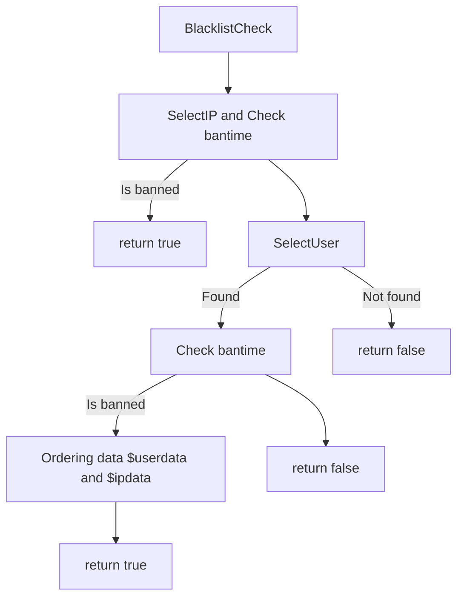

# brute-force-protection
Simple brute force defense (php)

# Methods
List of methods that can be used immediately, without prior preparation


# Basic Methods
The specified methods are basic, you can use them instead of the methods of the AntiBruteForce class.

Function: **BlacklistCheck**
```php
BruteForceProtection::BlacklistCheck($userID,$hash,$intIP)
```
>Checks if the $userID and $intIP are in the banned list, and if they are, firstly, it saves the data, and secondly, it duplicates the punishment on $intIP for the banned $userID.<br>**return**: returns true or false.
